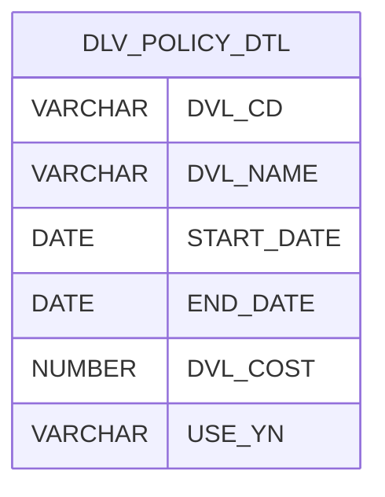

# add-history-to-table-api

> #### 배경
>
> > 프로젝트가 끝나고 나서 가장 기억에 남는 문제 해결 경험이 있다.
> > 현대 홈쇼핑 차세대 프로젝트 중 **수기로 관리하는 배송비 정책을 자동화 할 수 있는 기준정보 관리 서비스 구축**을 요구사항으로 받았었다.
> > 이 데이터는 주문 파트에서 주문한 상품의 배송비를 적용해야 했기에 현재 날짜 기준으로 조회 시, 정확한 1개의 Row를 반환이 중요했다.
> > 그런데 **"하나의 배송비 정책 내역 테이블이 이력 관리도 됐으면 좋겠다."**가 전제였다. 보통 정책은 잘 바뀌지 않는 데이터 이기에 별도로 이력 테이블을 만들지 않겠다고 결정이 났다. 추가적인 조건은 이러했다.
> >
> > > 1. 배송비 정책 코드(N가지)가 공통코드로 주어지고 적용 날짜와 종료 날짜가 있어야 한다.
> > > 2. 적용날짜 별로 차례대로 화면에 노출되어야 한다.
> > > 3. 특정 정책 코드 3가지는 변경 될 시 적용 날짜와 배송비 금액이 함께 Update 해야하며, 이력성도 포함해야한다.

> #### 목표
>
> > 하나의 배송비 정책은 적용 날짜 기준으로 올림차순으로 등록 되어야 한다.
> > A라는 정책이 신규 적용 날짜로 등록 시, 이전 종료날짜가 신규 적용 날짜에 YYYY-MM-DD 23:59:59초로 UPDATE 되어야 한다.
> > 사용자가 화면에서 실수 등록을 하더라도 올바르게 이력 관리가 되도록 해야 한다.

## 목차

1. [설계](#-설계)
2. [구현](#-구현)
3. [테스트](#-테스트)
4. [Problem-Solving and Key Considerations](#-Problem-Solving-and-Key-Considerations)

---

## ▶ 설계

1. **내역 테이블 설계**

    -  각각의 배송비 정책은 적용날짜와 종료날짜를 가진다. 등록 시, Default로 종료날짜는 (9999-12-31 23:59:59) 로 설정한다.
    - USE_YN은 화면에 노출 될 정책을 정하기 위해서 추가 하였다.
        - 사용자는 사용여부를 화면에서 조작이 불가능 하다.
        - 사용자는 사용여부가 "Y"인 데이터 즉, 실제로 적용된 배송비 정책만 확인을 하고 관리가 가능하다.
        - 배송비 정책 "N"에 기준은 배송비 등록 시 기준에 부합하지 않는 데이터를 N으로 업데이트 한다.
            - EX. 실수로 등록 해버린

2. **이력관리 방안**
