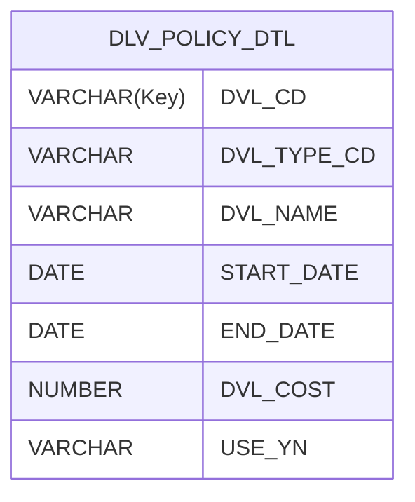

# add-history-to-table-api

#### 배경

> 프로젝트가 끝나고 나서 가장 기억에 남는 문제 해결 경험이 있다.
> 현대 홈쇼핑 차세대 프로젝트 중 **수기로 관리하는 배송비 정책을 자동화 할 수 있는 기준정보 관리 서비스 구축**을 요구사항으로 받았었다.
> 이 데이터는 주문 파트에서 주문한 상품의 배송비를 적용해야 했기에 현재 날짜 기준으로 조회 시, 정확한 1개의 Row를 반환이 중요했다.
> 그런데 **하나의 배송비 정책 내역 테이블이 이력 관리도 됐으면 좋겠다.**가 전제였다. 보통 정책은 잘 바뀌지 않는 데이터 이기에 별도로 이력 테이블을 만들지 않겠다고 결정이 났다. 추가적인 조건은 이러했다.
>
> > 1.  배송비 정책 유형 코드(N가지)가 공통코드로 주어지고 적용 날짜와 종료 날짜가 있어야 한다.
> > 2.  적용날짜 별로 차례대로 화면에 노출되어야 한다.
> > 3.  특정 정책 유형 코드 3가지는 변경 될 시 적용 날짜와 배송비 금액이 함께 Update 해야하며, 이력성도 포함해야한다.
> > 4.  신규 배송 정책 등록 시, 항상 오늘 날짜 이후에 정책만 등록이 가능하다.

#### 목표

> 하나의 배송비 정책은 적용 날짜 기준으로 올림차순으로 등록 되어야 한다.
> A라는 정책이 신규 적용 날짜로 등록 시, 이전 종료날짜가 신규 적용 날짜에 YYYY-MM-DD 23:59:59초로 UPDATE 되어야 한다.
> 사용자가 화면에서 실수 등록을 하더라도 올바르게 이력 관리가 되도록 해야 한다.

## 목차

1. [설계](#-설계)
2. [구현](#-구현)
3. [테스트](#-테스트)
4. [Problem-Solving and Key Considerations](#-Problem-Solving-and-Key-Considerations)

---

## ▶ 설계

### Business Layer와 DAO Layer 전략

<details>
<summary>mybatis-spring-boot-starter 알아보기</summary>

MyBatis-Spring-Boot-Starter는 MyBatis와 Spring Boot를 쉽게 통합할 수 있도록 도와주는 스타터 패키지입니다. 이 스타터 패키지는 여러 가지 자동 설정을 제공하여 개발자가 설정해야 할 항목을 최소화합니다 </br>
mybatis-spring-boot-starter는 현재 2024 4월 기준으로 3.0.2까지 버전을 둔다 </br>
또한 3.0버전을 쓰기 위해서는 Spring Boot는 3.0 이상 java 17 버전 이상이여야 한다. </br>

### 1. DataSource 자동 감지

MyBatis-Spring-Boot-Starter는 기존에 정의된 `DataSource`를 자동으로 감지합니다. Spring Boot는 데이터베이스 연결 정보를 기반으로 `DataSource` 빈을 생성합니다. 이 `DataSource`는 MyBatis 설정에서 사용됩니다.

**예시**:
Spring Boot가 `application.yml` 파일에서 데이터 소스 설정을 감지하고 자동으로 `DataSource` 빈을 생성합니다.

```properties
spring:
  application:
    name: history
  datasource:
    url: jdbc:oracle:thin:@localhost:1521/xe
    username: system
    password: 12345
    driver-class-name: oracle.jdbc.OracleDriver
```

### 2. SqlSessionFactory 인스턴스 생성 및 등록

MyBatis-Spring-Boot-Starter는 `SqlSessionFactoryBean`을 사용하여 `SqlSessionFactory` 인스턴스를 생성하고, 이를 Spring 컨텍스트에 빈으로 등록합니다. `SqlSessionFactory`는 MyBatis가 SQL 세션을 생성하는 데 사용됩니다.

**설명**:

- `SqlSessionFactoryBean`은 `DataSource`를 입력으로 받아 `SqlSessionFactory`를 생성합니다.
- `SqlSessionFactory`는 MyBatis의 주요 설정 객체로, SQL 세션을 생성하는 역할을 합니다.

### 3. SqlSessionTemplate 인스턴스 생성 및 등록

MyBatis-Spring-Boot-Starter는 `SqlSessionFactory`로부터 `SqlSessionTemplate` 인스턴스를 생성하고, 이를 Spring 컨텍스트에 빈으로 등록합니다. `SqlSessionTemplate`은 MyBatis의 주요 실행 객체로, `SqlSession`을 구현하여 SQL 쿼리를 실행하는 역할을 합니다.

**설명**:

- `SqlSessionTemplate`은 `SqlSession`의 구현체로, 쓰레드 안전하며 트랜잭션 관리, 예외 처리를 포함한 MyBatis 작업을 수행합니다.

### 4. 매퍼 자동 스캔 및 등록

MyBatis-Spring-Boot-Starter는 매퍼 인터페이스를 자동으로 스캔하고, 이를 `SqlSessionTemplate`과 연결하여 Spring 컨텍스트에 빈으로 등록합니다. 이를 통해 매퍼 인터페이스를 Spring의 의존성 주입(Dependency Injection)으로 사용할 수 있게 됩니다.

**설명**:

- `@MapperScan` 어노테이션을 사용하여 매퍼 인터페이스가 위치한 패키지를 지정하면, MyBatis가 해당 패키지의 모든 매퍼 인터페이스를 자동으로 스캔하고 빈으로 등록합니다.

### 5. springBoot 3.3 버전 지원 이슈 문제

최근 MyBatis와 Spring Boot 3.3의 호환성 문제에 대해 여러 보고가 있었습니다. 주된 문제는 factoryBeanObjectType 속성의 잘못된 타입 지정으로 인한 예외입니다.

불행하게도 MyBatis 3가 공식적으로 릴리스되기 전에 Spring 3개발이 종료되고 릴리스를 지원하지 않았다.

Mybatis 팀은 3.0.3을 릴리즈 되었지만 완전하지는 않다.

</details>

1. **내역 테이블 설계**

배송비 정책 내역 테이블

```
CREATE TABLE DVL_POLICY_DTL(
    DVL_CD VARCHAR2(10) PRIMARY KEY,
    DVL_TYPE_CD VARCHAR2(10) NOT NULL,
    DVL_NAME VARCHAR2(100),
    START_DATE DATE NOT NULL,
    END_DATE DATE NOT NULL,
    DVL_COST NUMBER NOT NULL,
    USE_YN VARCHAR2(10) NOT NULL CHECK (USE_YN IN ('Y','N'))
);
```

배송비 정책 공통 코드

```
CREATE TABLE DVL_TYPE_CM_CD(
    CD VARCHAR2(10) PRIMARY KEY,
    CD_NAME VARCHAR2(10) NOT NULL
);

INSERT INTO DVL_TYPE_CM_CD (CD, CD_NAME) VALUES ('01','A');
INSERT INTO DVL_TYPE_CM_CD (CD, CD_NAME) VALUES ('02','B');
INSERT INTO DVL_TYPE_CM_CD (CD, CD_NAME) VALUES ('03','C');
INSERT INTO DVL_TYPE_CM_CD (CD, CD_NAME) VALUES ('04','D');
INSERT INTO DVL_TYPE_CM_CD (CD, CD_NAME) VALUES ('05','E');
```



    - DVL_CD은 배송비 정책이 추가 될 때, Seq 형식으로 Primary Key가 된다.
    - 각각의 배송비 정책은 적용날짜와 종료날짜를 가진다. 등록 시, 종료날짜는 항상 Default로 (9999-12-31 23:59:59) 로 설정한다.
        - 정책 특성 상, 사용자는 항상 오늘 날짜 이후 적용 날짜를 가진 정책만 등록이 가능하다.
        - 사용자는 종룍 날짜를 수정하거나 입력하지 못한다.
    - USE_YN은 화면에 노출 될 정책을 정하기 위해서 추가 하였다.
        - 사용자는 사용여부를 화면에서 조작이 불가능 하다.
        - 사용자는 화면에서 사용여부가 "Y"인 데이터 즉, 실제로 적용된 배송비 정책만 확인을 하고 관리가 가능하다
        - 배송비 등록 시 기준에 부합하지 않는 데이터 사용여부 "N"으로 업데이트 한다.
            - EX. 사용자 등록 실수를 처리하기 위함

2. **동일 유형 이력관리 방안**

**등록 케이스 (그리드 행의 Flag가 I인 경우)**

- 이전 보다 미래 날짜로 신규 등록 시

| DVL_CD | DVL_TYPE_CD | DVL_NAME | START_DATE          | END_DATE                | DVL_COST | USE_YN |
| ------ | ----------- | -------- | ------------------- | ----------------------- | -------- | ------ |
| 0001   | 01          | A        | 2022-03-01 00:00:00 | **2022-03-07 23:59:59** | 1000     | Y      |
| 0002   | 01          | A        | 2022-03-08 00:00:00 | 9999-12-31 23:59:59     | 2000     | Y      |

    - 새로운 배송비 정책(DVL_TYPE_CD = "01")이 2022-03-08에 등록됩니다.
    - 기존 배송비  정책(DVL_CD = "0001")은 새로운 배송비 정책 보다 시작 날짜가 과거 이기 때문에 END_DATE 2022-03-07 23:59:59 로 업데이트 합니다.

- 최근 등록된 두 개의 행의 적용 날짜 사이로 등록 시

| DVL_CD | DVL_TYPE_CD | DVL_NAME | START_DATE          | END_DATE                | DVL_COST | USE_YN |
| ------ | ----------- | -------- | ------------------- | ----------------------- | -------- | ------ |
| 0001   | 01          | A        | 2022-03-01 00:00:00 | **2022-03-04 23:59:59** | 1000     | Y      |
| 0002   | 01          | A        | 2022-03-08 00:00:00 | 9999-12-31 23:59:59     | 2000     | Y      |
| 0003   | 01          | A        | 2022-03-05 00:00:00 | **2022-03-07 23:59:59** | 6000     | Y      |

    - 새로운 배송비 정책(DVL_TYPE_CD = "01")이 2022-03-05에 등록됩니다.
    - 기존 정책 중 적용 날짜가 새로 등록할 정책보다 미래 이기 때문에 정책(DVL_CD = "0003")의 END_DATE을 "0002"의 정책 시작 시간에 -1초 전 시간으로 업데이트합니다.
    - 이전 정책(DVL_CD = "0001")을 비교 했을 때, "0003"보 다 과거 이므로 END_DATE를 2022-03-04 23:59:59로 업데이트합니다.

- 최근 등록된 행과 적용 날짜가 동일하게 등록 시

| DVL_CD | DVL_TYPE_CD | DVL_NAME | START_DATE          | END_DATE            | DVL_COST | USE_YN |
| ------ | ----------- | -------- | ------------------- | ------------------- | -------- | ------ |
| 0001   | 01          | A        | 2022-03-01 00:00:00 | 2022-03-07 23:59:59 | 1000     | Y      |
| 0002   | 01          | A        | 2022-03-08 00:00:00 | 9999-12-31 23:59:59 | 2000     | **N**  |
| 0003   | 01          | A        | 2022-03-08 00:00:00 | 9999-12-31 23:59:59 | 6000     | Y      |

    - 새로운 배송비 정책(DVL_TYPE_CD = "01")이 2022-03-08에 등록됩니다.
    - 등록 된 정책 중 (DVL_CD = "0002") 정책의 적용 날짜와 같기 때문에, 기존 정책의 USE_YN를 "N"으로 업데이트 합니다.
    - 사용자는 USE_YN의 값이 "Y"인 데이터만 화면에 보여지기 때문에 (DVL_CD = "0002") 정책은 화면에 미노출, 실제로는 삭제가 되지 않는다.

3. **3가지 유형 동시 이력관리 방안**
